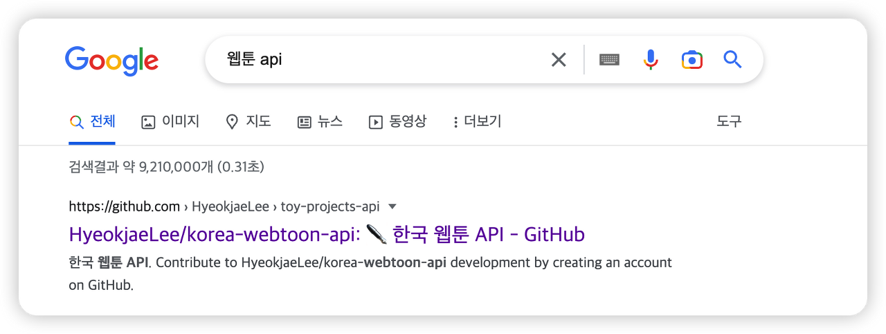

2020년 말쯤 웹툰 통합 정보 사이트를 만들어 보자는 생각으로 Webtoon hub라는 토이 프로젝트를 개발했을 때 개발했던 API를 버려두기 아까워 호스팅 후 공개해뒀었는데 예상외로 자잘한 트래픽이 발생하고 있길래 글로 남겨본다.

## 도구 선정

별다른 기능은 없고 단순히 웹툰 정보들을 수집하고 수집한 정보들을 정형화해서 뿌려줄 생각이었기 때문에 가장 간편하게 만들 수 있는 Express를 이용해 개발했고 굳이 항상 서버가 켜져 있을 필요가 없었기 때문에 서버 Sleep이 존재하는 대신 무료로 사용할 수 있는 Heroku를 이용해 배포했다.

> 2022-12-01 유료로 변경됨

## 동작 방식

특정 간격마다 작동하는 봇이 서비스별로 적합한 방식으로 정보를 수집해 가공 후 동일한 형식으로 뿌려주는 구조로 개발했다.

Naver 웹툰과 Daum 웹툰 두 가지 정보를 제공하고 있는데 각각 다음과 같은 방식으로 정보를 수집했다.

### Naver

네이버 웹툰은 정보를 필요할 때마다 받아와서 렌더링 하는 방식으로 구현되어있지 않고 서버사이드에서 렌더링 되어 페이지가 뿌려지고 있었기 때문에 HTTP 요청시점에 필요한 모든 웹툰 정보들을 HTML에서 확인할 수 있으므로 Cheerio로 파싱만 하면 원하는 정보를 가져올 수 있다.

따로 크롤링 방지를 위한 장치는 없었다.

### Daum

각 웹툰의 정보들을 필요할 때마다 서버로부터 제공받아 렌더링 하는 형식으로 구현되어있었다.

HTML에서 정보를 가져오려면 페이지가 모두 렌더링 될 때까지 기다려야 했으므로 성능이 좋지 않고 Puppeteer 같은 라이브러리가 필요하다.

대신 Daum 웹툰 API의 Endpoint를 찾아서 적절한 파라미터를 함께 넘기면 실제 다음 웹툰 클라이언트가 서버에 요청하는 것과 동일한 데이터를 받을 수 있다.

각 필드의 정보가 무엇인지 실제 배포되고 있는 페이지와 비교해서 파악했다.

## 업데이트

### 🗓️ 2021-11-17

8월에 기존 Daum 웹툰이 Kakao 웹툰으로 개편되었는데 단순 명칭 변경이 아닌 실제 API에 많은 변화가 있었다.

기존 봇이 당연하게도 정상적으로 정보를 불러오지 못했기 때문에 API를 업데이트해야만 했다.

추가적으로 코드 구조가 마음에 안 들어서 Express에서 Nest로 프레임워크를 변경하고 Kakao Page 웹툰 정보도 추가해 주었다.

Kakao 웹툰 클라이언트를 직접 크롤링하는 방식과 Daum 웹툰 정보를 수집했을 때와 같은 방법으로 API에 요청을 보내 정보를 받는 방식을 시도해 보았는데 아래 이슈들 때문에 후자를 선택했다.

#### 카카오 웹툰 클라이언트를 직접 크롤링할 때 발생한 이슈

##### CSR

CSR 앱은 HTTP 요청 시점에 HTML 정보를 가지고 있지 않기 때문에 puppeteer를 이용해 크롤링해야 했다.

##### 일반적인 사용자 접근이 아니면 페이지 접근 차단

Puppeteer가 핸들링하는 Chromium에 사용자 정보를 추가해 줬다.

##### 짧은 시간 내에 잦은 요청을 보내면 IP를 일시적으로 차단

요청 대기 시간을 추가해 주었다

##### 해외 IP 차단

Proxy를 사용해 IP를 변경했다.

> 위 이슈들을 모두 해결하고 나니 크롤러의 속도가 매우 느렸고 Proxy까지 붙여놓아서 굉장히 불안정했기 때문에 기존 Daum 웹툰과 같은 방식으로 데이터를 수집하기로 했다.

### 🗓️ 2022-12-01

현생이 바빠서 API에 신경을 못쓰고 있었는데 API가 정상적으로 작동하지 않는다는 메일을 받았다.

> 
> 내가 만든 API를 쓰는 사람이 있긴하구나 생각했는데 알고보니 구글 검색 상단에 노출되고 있어서 간간히 트래픽이 발생하고 있었다.

로그를 보니 Naver와 Kakao Page의 봇들이 정상적으로 작동하지 않고 있었다.

Naver의 경우엔 클라이언트 구조가 살짝 바뀌어서 일부 정보만 못 불러오는 상태였고 Kakao Page는 GraphQL 도입으로 인해 기존 REST API Endpoint가 없어졌다.

다행히 GraphQL API 자체는 익숙했기 때문에 금방 적용했다.

다만 해당 API가 오픈 API는 아니다 보니 각 필드의 의미를 파악하는게 쉽진 않았다.

혹시나 해서 API Endpoint를 Apollo Playground에 넣고 돌려봤지만 역시나 프로덕션 API는 따로 문서를 제공하지 않았다.

실제 Kakao Page 클라이언트에서 요청하는 쿼리를 보고 필요한 내용만 추려서 요청하는 식으로 구현했다.

> 개발한 API는 아래 링크에서 확인할 수 있다.
> https://github.com/HyeokjaeLee/korea-webtoon-api
