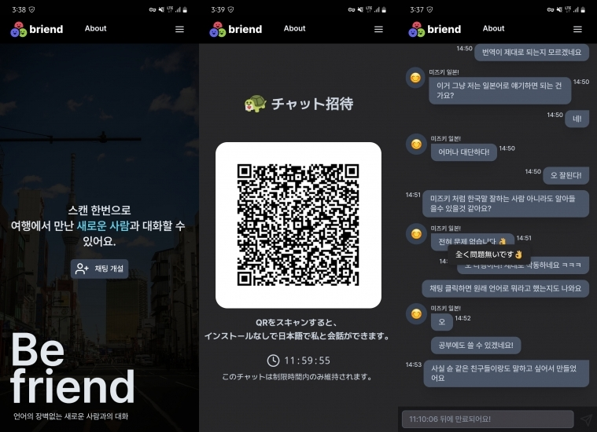

**나는 여행다니면서 현지 새로운 사람들을 만나는것을 좋아한다.**

하지만 영어를 잘하는 편은 아니라 가끔 소통이 불편해서 번역기를 자주 이용했는데 마이크를 상대한테 가져다 대고 인식이 될때 까지 뻘쭘한 시간을 보내는것이 불편해서 어떻게 하면 좀더 편하게 소통할 수 있을까 고민하던 와중에 떠올린 간단한 앱을 개발했다.

> 영어는 못하지만 코딩은 할 줄 알지...
> 보통 내 토이 프로젝트들은 내 불편함을 해결하기 위해 개발한다.

## 기획

우선 생각한 기능은 단순하다.

실시간 번역을 지원하는 채팅 어플을 만드는거다.

하지만 여러가지 고민해야 할 부분들이 있었는데 다음과 같다.

### 편의성

우선 상대방에게 부담없이 들이밀기 위해선 초대 받는 사람의 앱 사용 뎁스를 최소한으로 해야한다.

채팅에 필요한 최소한의 정보를 받되 모든 정보는 초대 하는 사람이 입력하도록 했다.

QR을 스캔하면 바로 브라우저에서 사용할 수 있는 웹앱 형식을 생각했다.

네이티브 앱같은 경험을 주기 위해서 PWA도 지원했다.

호스트 사용자(한국인)는 카카오 로그인을 통해 별도의 가입 없이 사용할 수 있게 했고 다크 모드나 로그인 저장 같은 단순한 편의 기능들만 추가 해주었다.

### 개발 스택 선정

Next 13 버전에 신기능들이 많이 추가되었는데 이참에 이것들을 사용해 보고 싶었다.

디자인은 이전에 만들어놓은 컴포넌트 라이브러리를 사용해서 크게 고민하지 않고 컴포넌트들을 배치하면서 진행했다.

> 해당 컴포넌트 라이브러리는 [pastime-ui](https://github.com/HyeokjaeLee/pastime-ui)에서 확인해 볼 수 있다.
> 지금 읽고 있는 이 블로그 역시 위 컴포넌트로 개발되었다.

기존 page 기반 디렉토리 대신 API를 포함한 모든 페이지 컴포넌트들은 App router를 적극 사용했다.

> 개발하고 있는 시점에 아직 작성중인 공식문서들도 있어서 좀 애먹었다.

빠르게 개발을 진행하고 싶었기 때문에 큰 고민없이 스타일링 코드를 칠 수 있는 `Tailwind` 라이브러리를 사용했다.

#### 배포 환경

배포환경은 Next.js로 개발했고 무료 플랜이 필요해서 Vercel를 선택했다.

하지만 한가지 간과했던게 있었는데 Vercel 무료 플랜은 Serverless 배포한경이라 Websocket이 뜰 수 없었다.

이걸 메인 기능을 모두 `Soket.io`로 모두 개발해버린 다음에 알아 버려서 나중에 `Pusher` 코드로 마이그레이션 하는데 고생했다.

> 이전에 회사에서 Next를 이용해 개발했을때 Serverless 배포환경에서 제한되는 기능들이 조금 있었는데 마찬가지로 정보들을 찾기가 힘들어서 애먹었었다.

번역 API는 평소에 개발하면서 잘 쓰고 있던 DeepL이 이전에는 지원하지 않던 한국 지역 API를 지원하게 되면서 바로 선택했다.

> 개인적으로 DeepL의 번역이 가장 자연스럽다고 느낌

#### DB

DB는 따로 두지 않고 모든 채팅 정보들은 `Indexed DB`를 통해 브라우저에서 관리되도록 했다.

이렇게 하면 데이터 CRUD의 서버 호출 비용은 최소화 하면서 채팅 정보 관리에 대한 책임도 어느정도 전가할 수 있을거라 생각했다.

별도의 서버 구축 없이 Next에서 모든걸 개발 할 수 있으니 이전에 서버 작업이 필요했던 토이 프로젝트들에 비해 매우 편리하게 개발을 진행할 수 있었던것 같다.

### 유지비

일단 사용자가 엄청 많을거라고 생각하지 않고 내 필요에 의해 개발한 앱인 만큼 유지비가 없었으면 좋겠다고 생각했기 때문에 Vercel, Pusher, DeepL 모두 무료 플랜을 사용했다.

이중에 DeepL의 무료 플랜이 병목이 될 가능 성이 크므로 어떻게든 불필요한 호출을 최소화 하기 위해 고민했다.

그래서 생각해 낸게 모든 요청을 번역하지 않고 실제 상대방이 원문 메시지를 정상적으로 수신한 후 메시지를 전달 받은 측에서 번역 API를 호출해서 번역하도록 했다.

> 번역 API를 호출하는 김에 메시지를 잘 전달 받았음을 알릴 수 있는 트리거를 달아주었다.

일단 지금 처럼 소소한 트래픽에서는 유지비가 전혀 들지 않는 프로젝트라 할 수 있겠다.

그 외에도 Pusher 채널을 항시 열어 놓을 수 없으니 일정 시간이 지나면 해당 채널의 토큰이 만료되도록 설정해 두었고 상대방이 채팅 화면을 보고 있는지 체크하고 채팅 화면을 보고 있을때만 메시지를 전달 할 수 있도록 개발했다.

## 테스트

모든 개발이 완료된 후엔 일본을 여행했을때 사귀었던 한국말을 잘하는 일본 친구에게 테스트를 부탁했다.

생각보다 대화가 굉장히 자연스러워서 놀랐다.

응답 속도 역시 무료 플랜들로 도배해놓은 프로젝트 치곤 나쁘지 않다.

## 느낀점

평소 디자이너와 백엔드 개발자분들과 협업을 하니 디자인이나 API에 대한 고민이 많이 줄었던것 같은데 다시 한번 그 분들의 소중함을 느낀다.

물론 이런 고민들이 즐겁긴 하지만 한번에 이것저것 하려니 실제로 코드 치는 시간보단 그외 것에 대한 고민들이 많았던것 같다.

당장 다음주에 또 일본에 가는데 한번 사용해 봐야겠다.
