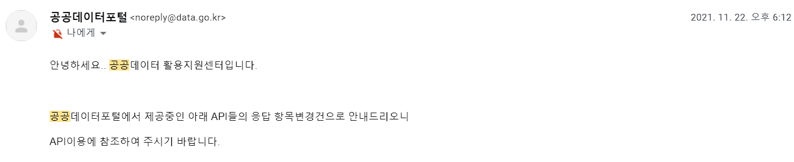

이전에 진행했던 프로젝트들이 요즘 한 번에 삐걱거리기 시작했다.

얼마 전에는 Webtoon API를 전체적으로 수정해야 했는데 이번에는 Covid-19 API가 문제다.

정부에서 단계적 일상 회복을 시행함에 따라 공공데이터 포털의 Covid-19 API의 일부 항목이 제외된 것이다.

오늘은 이것에 대해 글을 써보려 한다.

## COVID-19 API

이전에 Toyproject용으로 COVID-19의 여러 외부 정보들을 종합해 새로운 데이터를 추가하고 이상치를 제거해 GraphQL로 데이터를 제공하는 서버를 호스팅 해두었다.

Toyproject는 데이터를 이용해 정보를 제공하는 Dashboard였다.

이번에 API를 수정하면 당연히 Dashboard도 변경사항이 생길 것이고 나는 이것을 최소화하고 싶었다.

### 변경점과 대응

#### 보건복지부 코로나19 시·도별 생 현황의 격리 중 환자 수 항목 제외

다행히 이 항목으로 계산하는 다른 값들이 없어 처음에는 해당 항목은 그냥 제거하려고 했다.

하지만 다른 항목들의 값들을 보면서 이 값은 다른 항목의 값들로 계산할 수 있을 것 같았다.

전체 확진자 수에서 사망자 수와 격리 해제 수를 제외하면 격리 중 환자수와 같을 거라는 예상을 했고 여러 날짜의 값들을 계산해서 비교해보

#### 단계적 일상 회복

정부에서 단계적 일상 회복을 시행하면서 당연히 거리두기 단계가 무의미 해졌고 실제로 정부에서 운영하던 사회적 거리두기 단계를 제공하는 사이트도 사라졌다.

문제는 내가 만든 API에서 사용하는 거리두기 단계는 이 사이트를 매일 크롤링해온 값으로 제공되는데 사이트가 없어졌고 거리두기 단계 자체도 무의미 해졌으니 이 항목은 제외할 수밖에 없었다.

#### 기존 데이터 저장

혹시 몰라 이전 데이터들은 모두 JSON 형식으로 저장해두었다.

이전 데이터를 사용하는 프로젝트가 있다면 Github에 저장된 JSON값을 받아와 보이는 뷰 정도만 유지해줄 생각이었다.

#### Dashboard 수정

앞서 언급했던 것처럼 API를 수정한 뒤 실제로 제외된 항목은 사회적 거리두기 단계밖에 없으니 관련된 그래프들을 모두 제거해주었다.

정부에서 정한 거리두기 단계 기준과 실제 감염 상황으로 거리두기 단계 변화를 예상하는 그래프는 지우기 아까웠지만 제공되는 데이터가 모두 사라진 마당에 남겨둘 수 없었다.

## Project Github Repo

- [COVID-19-Dashboard](https://github.com/HyeokjaeLee/covid19-dashboard)
- [Korea-COVID19-API](https://github.com/HyeokjaeLee/korea-covid19-api)
