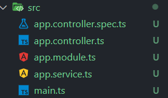

NestJS는 Express와 함께 Node.js의 대표적인 서버 구축을 위한 프레임워크 중 하나이다.

Express와 용도는 같지만 사용해보면 둘은 다른 점이 많다.

## NestJS를 사용하는 이유

아래 내용들은 내가 NestJS를 사용하는 이유이다.

개인적인 선호가 포함된 부분들도 있어서 참고만 하고 자세한 내용은 [NestJS 공식문서](https://docs.nestjs.com/)를 참고하는 게 좋다.

### 코드의 통일성

Express에 비해 NestJS는 개발 구조에 대한 자유도 낮다.

자유도가 높을수록 좋은 것이 아닌가 하고 생각할 수 있지만 자유도가 높다는 말은 통일성이 부족하다는 말도 된다.

프로그램의 규모가 커지고 여러 명의 사람들과 협업을 하다 보면 이런 자유도가 오히려 독이 되는 경우가 많다.

개인적으로 다른 사람들의 Express 코드들을 찾아볼 때 개발자들마다 다른 코드 구조 때문에 특정 역할을 하는 코드를 찾는데 애먹는 경우가 많았다.

NestJS는 자유도를 낮추는 대신 이런 문제점들을 개선했다고 볼 수 있다.

정의된 각 클래스마다 역할이 있고 제한된 NestJS의 구조안에서 개발을 진행하게 된다.

이런 제한된 구조가 코드의 통일성을 높여준다.

### Module class

NestJS는 관련 있는 기능들 등을 한 module class에 담아 캡슐화한다.

각 module들은 서로 import 가능하며 이는 코드 간 의존성을 낮춰준다.

즉 확장성, 유지보수성, 테스트 가능성 등이 향상된다.

### Typescript

NestJS는 기본적으로 Typescript를 지원하며 Typescript 사용을 권장한다.

Express에서 Typescript를 사용하려면 직접 여러 가지 설정을 해주어야 하는 번거로움이 있지만 NestJS는 아무런 설정 없이 바로 사용이 가능하다.

Typescript를 사용하면 컴파일러단에서 오류를 잡아주어 애플리케이션의 예상치 못한 문제들을 미리 방지해준다.

또한 데코레이터 같은 Typescript의 실험적 기능들도 굉장히 적극적으로 사용하고 있는 모습을 볼 수 있다.

NestJS는 이러한 Typescript의 장점을 기본적으로 가지고 있다고 볼 수 있다.

### 간편한 테스트

초기 생성된 NestJS의 구조를 보면 spec.ts 파일을 볼 수 있는데 이는 테스트를 위한 파일이다.

기본적으로 NestJS는 간편한 Unit Test를 지원한다.

## NestJS로 웹서버 구축하기

NestJS 프로젝트 생성 방법은 여러 가지가 있지만 이 글에서는 cli를 통한 방법을 기준으로 설명하겠다.

### NestJS CLI 설치

```
npm i -g @nestjs/cli
```

### CLI를 통해 새 프로젝트 생성 & 실행

```
# 새 프로젝트 생성
nest new <프로젝트명>

# nest 실행
npm run start
```

생성된 프로젝트의 구조는 다음과 같다.


- **app.controller.spc.ts**: 유닛 테스트를 위한 파일
- **app.controller.ts**: 기본 컨트롤러
- **app.module.ts**: root 모듈을 정의
- **app.service.ts**: 관련 있는 기능들을 클래스에서 분리해서 작성하고 사용 시 controller에 import 해서 사용
- **main.ts**: nest factory instance를 생성하는 엔트리 파일

생성한 nest 프로젝트를 처음 실행하면 `localhost:3000`에 "Hello World!"가 표시됨을 알 수 있다.

### 코드 작성

위에 `Hello World!`를 `return` 하는 코드는 `app.service.ts`에서 찾을 수 있다.

이를 `app.controller.ts`에서 `import` 하고 `app.module.ts`에 이런 내용들이 정의되어 있는 것을 확인할 수 있다.

NestJS의 이러한 패턴은 글만으로는 이해하기 어렵다.

직접 코드를 작성하고 실행해 보면서 알아보자

아래 내용들은 이해를 돕기 위한 코드이다.

#### app.service.ts

```typescript
import { Injectable } from '@nestjs/common';
@Injectable()
export class AppService {
  constructor() {
    console.log('서비스 생성');
  }
  getHello(): string {
    return 'Hello World!';
  }
  getTest(): string {
    return '이것은 테스트입니다.';
  }
}
```

GetTest 메소드를 추가해주고 constructor에 실행 순서를 알 수 있는 출력을 추가해준다.

#### app.controller.ts

```typescript
import { Controller, Get, Query } from '@nestjs/common';
import { AppService } from './app.service';
@Controller()
export class AppController {
  constructor(private readonly appService: AppService) {}
  @Get()
  getHello(): string {
    return this.appService.getHello();
  }
}
@Controller('test') //테스트를 위한 컨트롤러
export class TestController {
  constructor(private readonly appService: AppService) {}
  @Get()
  getHello(): string {
    return this.appService.getTest(); //app.service.ts에 추가했던 GetTest()
  }
  @Get('query-test')
  getTest(@Query('query') query: string): string {
    return `입력받은 쿼리는 ${query}입니다.`;
  }
  @Get('middleware-test')
  getTestMiddleware(): string {
    console.log('middleware-test 컨트롤러');
    return 'middleware-test 컨트롤러';
  }
  @Get('middleware-test2')
  getTestMiddleware2(): string {
    console.log('middleware-test2 컨트롤러');
    return 'middleware-test2 컨트롤러';
  }
}
```

테스트를 위한 컨트롤러를 추가해준다.

test 컨트롤러의 root path에는 위에서 만들었던 getTest 메소드를 사용해 준다.

기본적으로 `@Controller("test")`는 `localhost:3000/test`에 라우팅 되며 다음과 같이 `@Get()`의 파라미터에 따라 endpoint를 지정할 수 있다.

- **@Get( )**: localhost:{port}/test
- **@Get("query-test")**: localhost:3000/test/query-test
- **@Get("middleware-test")**: localhost:3000/test/middleware-test
- **@Get("middleware-test2")**: localhost:3000/test/middleware-test2

#### TestMiddleware.ts

middleware도 한번 만들어 보자

src/middleware 경로에 TestMiddleware.ts 파일을 하나 만들어 준다.

```typescript
import { Injectable, NestMiddleware } from '@nestjs/common';
@Injectable()
export class TestMiddleware implements NestMiddleware {
  use(req: any, res: any, next: () => void): any {
    console.log('테스트 미들웨어 1 실행');
    const query = req.query.name;
    res.send(`테스트 미들웨어 쿼리 name=${query}`);
    return; //Middleware 이후 코드 실행X
  }
}
@Injectable()
export class TestMiddleware2 implements NestMiddleware {
  use(req: any, res: any, next: () => void): any {
    console.log(req.query);
    console.log('테스트 미들웨어 2 실행');
    next(); //Middleware 이후 코드를 실행
  }
}
```

- 첫 번째 TestMiddleware는 쿼리를 직접 해당 주소에 뿌려주는 코드이다.
- 두 번째 TestMiddleware2는 단순 실행 후 실행되었다는 콘솔 출력만 실행해 주는 코드이다.

#### app.modules.ts

이제 위에서 만들었던 컨트롤러와 미들웨어를 추가해줘야 한다.

controllers에 위에서 만든 TestController를 추가해준다.

```typescript
import {
  MiddlewareConsumer,
  Module,
  NestModule,
  RequestMethod,
} from '@nestjs/common';
import { AppController, TestController } from './app.controller';
import { AppService } from './app.service';
import { TestMiddleware, TestMiddleware2 } from './middleware/TestMiddleware';
@Module({
  imports: [],
  controllers: [AppController, TestController], //TestController추가
  providers: [AppService],
})
export class AppModule implements NestModule {
  configure(consumer: MiddlewareConsumer) {
    consumer
      .apply(TestMiddleware)
      .forRoutes({ path: 'test/middleware-test/*', method: RequestMethod.GET }); //테스트 미들웨어1
    consumer.apply(TestMiddleware2).forRoutes('test/middleware-test2'); //테스트 미들웨어2
  }
}
```

apply()에는 사용할 미들웨어를 지정해준다.

forRoutes에서 routing path를 지정해 줄 수 있다.

routing path는 wildcards를 이용해 작성할 수 있다.

> `*`는 wildcards로 사용되며 모든 문자조합과 일치한다.

```typescript
forRoutes({ path: 'ab*cd', method: RequestMethod.ALL });
```

즉 ab\*cd 라우트 경로는 abcd, ab_cd, abecd 등과 일치한다.

?,+,\*및() 문자는 라우트 경로에 사용될 수 있으며 해당 정규표현식 대응 부분의 하위 집합이다.

하이픈(-)과 점(.)은 문자열 기반 경로로 문자 그대로 해석된다.

forRoutes()에는 여러 개의 path를 콤마(,)를 이용해 지정할 수 있다.

```typescript
forRoutes('test/middleware-test', 'test/middleware-test2');
```

### 작성한 코드를 통해 알 수 있는 점

#### 서버 실행 시

app.service.ts의 AppService 클래스 생성에서 작성했던 콘솔은 1회 출력됨을 알 수 있다.

#### http://localhost:3000/test

app.service.ts에서 작성했던 "이것은 테스트입니다."가 페이지에 출력됨을 알 수 있다.

#### http://localhost:3000/test/middleware-test

app.controller.ts에서 작성했던 middleware-test 컨트롤러가 페이지와 콘솔에 출력됨을 확인할 수 있다.

우리는 app.module.ts에서 path를 test/middleware-test/\*로 지정해줬으므로 미들웨어가 실행되지 않음을 알 수 있다.

#### http://localhost:3000/test/middleware-test/test?name=coder

미들웨어가 실행되고 name이라는 쿼리를 받아 미들웨어에서 직접 페이지에 표시하는 것을 확인할 수 있다.

> 이 글에서는 지극히 기초적인 NestJS 사용법에 대해서만 다루었으므로 그 외 공식문서를 살펴보면서 직접 여러 가지 시도를 해보는 것을 추천한다.
